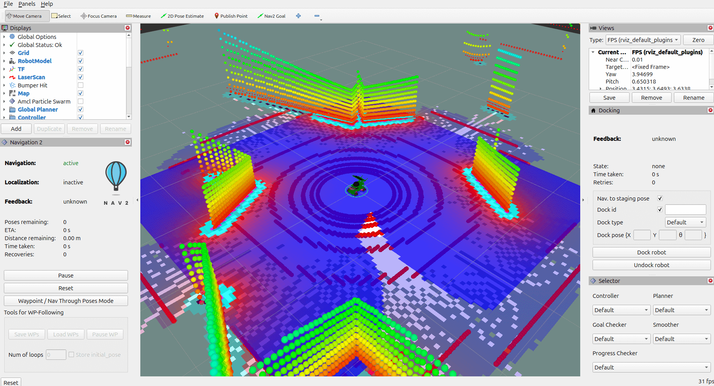

# Pointcloud-lab

A simulated mecanum robot with a 3D LiDAR sensor for testing, recording processing lidar point cloud data.



## Background

A 3D LiDAR sensor I attached to the first robot sim from a Udemy tutorial appeared to create blured and distorted point clouds in Rviz. This happened regardless of the IMU and odometry sensor fusion I attempted with an EKF filter. So I rebuilt another yahboom mecanum robot from another tutorial which included nav2 mapping with its EKF.

## The Problem

To minimize the point cloud distortion in Rviz, I attempted some EKF calibration. I tweaked noise covariance and how much odom vs IMU affects the robot's yaw rotation. Then I switched between using odom and the nav2 map as the world reference, and then back to using odom again but using nav2's amcl_pose instead to get localisation.

However, the point clouds visualised in Rviz from rotations were consistently out of sync when the yahboom robot rotated. The point clouds snapped back on the map when translating in position. I planned on attempting to make a filter that only recorded accurate point clouds during robot translation, and disregarded point clouds from rotation.

## The Solution

I attempted using SLAM Toolbox instead for real time mapping, and noticed that the default teleop controls were distorting the point clouds, whereas another script controlling the robot with acceleration and deceleration did not distort point clouds. So I later found that I resolved the rotation point cloud distortion issue by building SLAM friendly controls. This is where instead of controlling a robot with sudden and erratic movements, such as with the default ros2 teleop keyboard controls, these controls have acceleration and deceleration for all movement. This allows for SLAM friendly trajectories and predictable motion for consistent point cloud position tracking.

## Future Work
- Point cloud filtering
- Visualization tools

## Quick Start

### Pull Docker Image
```bash
docker pull nthnmillar/pointcloud-lab:latest
```
---
### Run Docker Container
```bash
xhost +local:docker
```
Run command suitable for your graphics card.

Intel/AMD (with /dev/dri access):
```bash
docker run -it \
  -e DISPLAY=$DISPLAY \
  -v /tmp/.X11-unix:/tmp/.X11-unix \
  --device /dev/dri \
  nthnmillar/pointcloud-lab
```
NVIDIA (requires NVIDIA Container Toolkit installed):
```bash
docker run -it \
  -e DISPLAY=$DISPLAY \
  -v /tmp/.X11-unix:/tmp/.X11-unix \
  --gpus all \
  nthnmillar/pointcloud-lab
```
CPU software rendering (fallback if no GPU or toolkit):
```bash
docker run -it \
  -e DISPLAY=$DISPLAY \
  -v /tmp/.X11-unix:/tmp/.X11-unix \
  -e LIBGL_ALWAYS_SOFTWARE=1 \
  nthnmillar/pointcloud-lab
```

---
### Install & Run
```bash
colcon build
```
```bash
source install/setup.bash
```
```bash
ros2 launch yahboom_rosmaster_bringup yahboom_slam.launch.py gz_headless:=true
```
### Robot Controls

Open an additional terminal.

```bash
docker ps
```
```bash
docker exec -it <container_name_or_id> /bin/bash
```
```bash
source install/setup.bash
```
```bash
ros2 run yahboom_rosmaster_system_tests smooth_keyboard_controller
```

## Credits

This project incorporates elements from the [yahboom_rosmaster](https://github.com/automaticaddison/yahboom_rosmaster) project by [Automatic Addison](https://automaticaddison.com/), which is licensed under the BSD 3-Clause License. 

### Modifications
This project includes:
- 3D lidar scanner integration
- Rviz config to visualise point clouds and SLAM
- Optimised EKF filter
- Gazebo world with perimeter walls and obstacles
- Controller script with acceleration and velocity suitable for localisation
- Docker containerization with GUI support
- Headless mode implementation for Gazebo

## License
This project is also licensed under the BSD 3-Clause License. See [LICENSE](LICENSE) file for details.

## Docker Hub

https://hub.docker.com/repository/docker/nthnmillar/pointcloud-lab/
